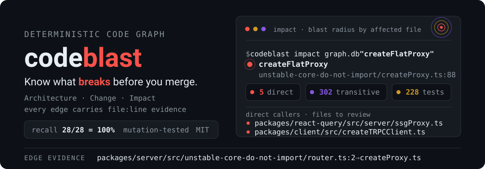

<p align="center">
  
</p>

<p align="center">
  <a href="#三个查询"></a>
  <a href="#精度承诺有边界有证据"></a>
  <a href="SKILL.md"></a>
  
</p>

**codeblast 把仓库解析成一份确定性代码图谱，回答改代码前后最贵的三个问题：**
> 🔗 **[在线交互演示](https://alloevil.github.io/codeblast/)** — tRPC / Tabby / sgp 的实时架构图,点开即可三层下钻

| | 问题 | 命令 |
|---|---|---|
| 🎯 | **改这个会炸哪里？** | `impact` — 直接/传递/受影响测试三级清单 |
| 🔍 | **这个 PR 在结构上改了什么？** | `change` — 符号与依赖边的增删/重命名 |
| 🗺️ | **这个项目长什么样？** | `archmap` — 模块折叠图 + 循环依赖检测 |

给人看（CLI / 交互 HTML / PR 评论），也给 AI agent 用（[SKILL.md](SKILL.md)）——同一份图谱，两个出口。

## 为什么不是又一个 LLM 画图工具

```
LLM 画图:    代码 → 模型阅读理解 → 手写图 → 渲染        图 = 模型的观点，无法核对
codeblast:   代码 → tsc/AST 确定性解析 → 图谱 → 投影    图 = 可验证的事实
```

**每个节点、每条边、每句结论都带 `file:line` 证据**，可直接打开核对。
LLM 在管线里只做一件事：给模块起人话名字——节点归属和边永远来自静态分析。

## 三个查询

```bash
# 建图：TS monorepo / Python 自动识别，hash 增量更新（tRPC 950 文件全量 ~20s）
bun run src/cli.ts <repo> --db graph.db

# ① Impact —— 改动前查影响半径
bun run src/impact-cli.ts graph.db "createOrder" --json
#    → direct 清单 = 必须检查的 callsite；tests 清单 = 必须跑的测试
#    → 双通道：调用链可达（精确率 ~0.70,优先看）+ import 可达（保守补充,勿跳过）

# ② Change Map —— 两个 ref 之间的结构 diff
bun run src/change-cli.ts <repo> main~5 main --json
#    → 意料之外的 edges_added = 改动越界信号

# ③ Architecture Map —— 交互 HTML：模块→文件→符号三层下钻，符号跳源码行
bun run src/archmap-html.ts graph.db --out arch.html --repo-url <github-url>

# 可选：git 历史耦合挖掘（协议两端、配置与消费者——静态分析看不见的边）
bun run src/cochange.ts <repo> graph.db
```

### PR bot（CI 内跑，宁静默不刷屏）

复制 [`.github/workflows-template/codeblast.yml`](.github/workflows-template/codeblast.yml) 到目标仓库：
每个 PR 自动评论结构变化 + 影响半径 + 无测试覆盖的新增符号；**无结构变化的 PR 零评论**。
50 个真实提交回放：42 个正确静默、评论有效率 87.5%。

## 精度承诺（有边界，有证据）

- **TypeScript 函数级，静态可分析范围内零漏报。** 验收方法：变异测试对照
  （真实仓库注入变异 → 全量测试得真实影响集 → 对比预测）。当前基准（tRPC，950 文件）：
  **28/28 变异召回率 100%**，平均精确率 0.36——宁误报不漏报是刻意交换：
  对照实验中砍掉保守边可将精确率提到 0.70，但召回率跌至 14%。数据在 [`eval/`](eval/)。
- **动态盲区显式标注。** eval / 动态 import / 子进程 / 鸭子类型——静态分析接不住的，
  记入 blind_spots 并提示"影响可能被低估"，绝不静默丢弃。
- **Python 为文件级。** 动态类型使函数级零漏报原理性不成立，不假装做到。

## 给 AI Agent 用

```
改前:  impact "symbol" --json   → callsite 清单进上下文，防漏改
改后:  change HEAD~1 HEAD --json → 自查结构越界与意外删除
```

完整契约与解读纪律（含"禁止假装盲区清单完整"）见 [SKILL.md](SKILL.md)。
Agent 规范另见 [AGENTS.md](AGENTS.md)。

## 状态与路线

M0 图谱引擎 → M1 Impact → M3 架构图 → M4 图 diff + PR bot → M5 精度扩展，**全部验收通过**（每项含可复现验收脚本）。方案与验收标准的单一事实源：[intent.md](intent.md)。

MIT © 2026
