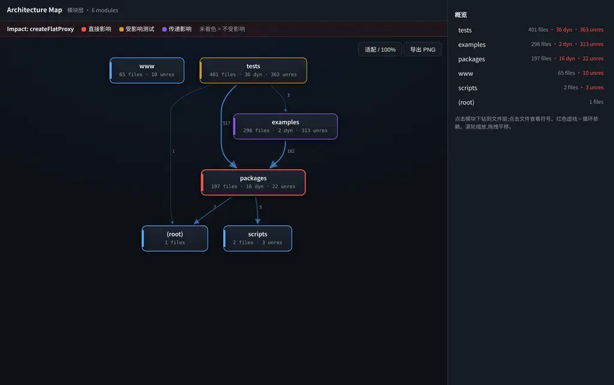
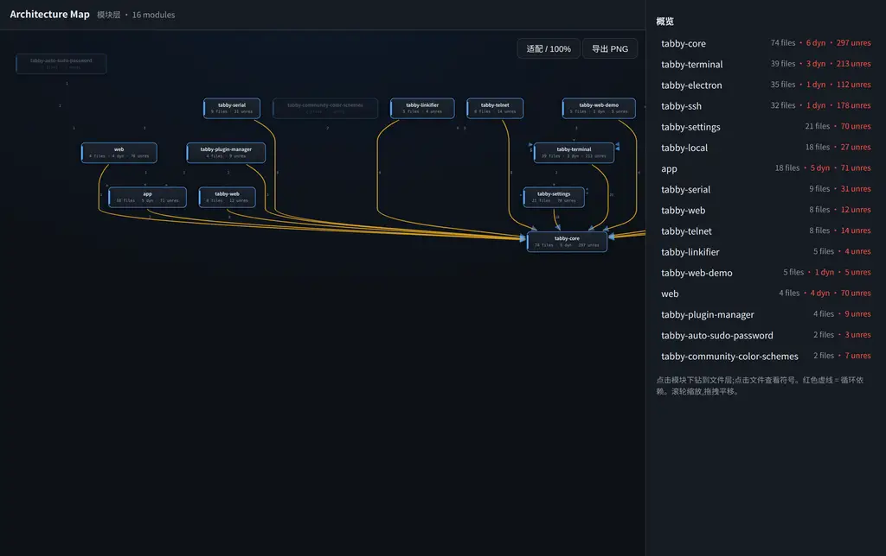
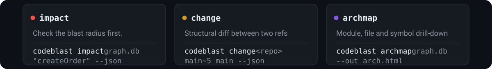

**codeblast** is a deterministic code-graph CLI for TypeScript and Python repositories that tells developers and AI agents what breaks before a change is merged.

<p align="center">
  
</p>

<p align="center">
  <b>English</b> | <a href="README.zh-CN.md">简体中文</a>
</p>

<p align="center">
  <a href="#the-three-queries"></a>
  <a href="#the-precision-promise-bounded-and-evidence-backed"></a>
  <a href="SKILL.md"></a>
  
</p>

## What it is

**codeblast parses your repository into a deterministic code graph and answers the three most expensive questions around any code change:**
> 🔗 **[Live interactive demo](https://alloevil.github.io/codeblast/)** — real architecture maps of tRPC / Tabby / sgp, with three-level drill-down

| | Question | Command |
|---|---|---|
| 🎯 | **What breaks if I change this?** | `impact` — direct / transitive / affected-tests, in three tiers |
| 🔍 | **What did this PR structurally change?** | `change` — symbols and dependency edges added, removed, renamed |
| 🗺️ | **What does this project look like?** | `archmap` — collapsible module map + circular-dependency detection |

Built for humans (CLI / interactive HTML / PR comments) and for AI agents ([SKILL.md](SKILL.md)) — one graph, two front-ends.
<table>
  <tr>
    <td width="50%">
      <a href="https://alloevil.github.io/codeblast/trpc-impact-demo.html">
        
      </a>
      <p align="center"><sub><b>Impact overlay</b> — blast radius on the map (tRPC · <a href="https://alloevil.github.io/codeblast/trpc-impact-demo.html">live ↗</a>)</sub></p>
    </td>
    <td width="50%">
      <a href="https://alloevil.github.io/codeblast/tabby-arch.html">
        
      </a>
      <p align="center"><sub><b>Architecture map</b> — hover lights the dependency fan-in (Tabby, 60k★ · <a href="https://alloevil.github.io/codeblast/tabby-arch.html">live ↗</a>)</sub></p>
    </td>
  </tr>
</table>

## Install

```bash
npx codeblast demo            # build a graph of the current repo, run one impact query, emit the map
npm i -g codeblast            # or install globally; needs Node ≥ 22.13 (built-in sqlite) or Bun

# Install as an agent skill (Claude Code, Codex, Cursor, and 14 more harnesses)
npx skills add alloevil/codeblast
```

## Why not yet another LLM diagram tool

```
LLM diagrams:  code → model reads it → hand-drawn graph → render     graph = the model's opinion, unverifiable
codeblast:     code → deterministic tsc/AST parse → graph → project  graph = checkable facts
```

**Every node, every edge, every claim carries `file:line` evidence** you can open and verify.
The LLM does exactly one job in the pipeline: giving modules human-readable names — node membership and edges always come from static analysis.

## The three queries

<p align="center">
  
</p>

```bash
# Build the graph: auto-detects TS monorepos / Python, hash-based incremental updates
# (full build of tRPC, 950 files, in ~20s)
codeblast index <repo> --db graph.db

# ① Impact — check the blast radius before you change anything
codeblast impact graph.db "createOrder" --json
#    → direct list = callsites you must review; tests list = tests you must run
#    → two channels: call-graph reachable (precision ~0.70, read first)
#      + import reachable (conservative supplement, don't skip)

# ② Change Map — structural diff between two refs
codeblast change <repo> main~5 main --json
#    → unexpected edges_added = a signal the change is out of scope

# ③ Architecture Map — interactive HTML: module → file → symbol drill-down,
#    symbols link to source lines
codeblast archmap graph.db --out arch.html --repo-url <github-url>

# Optional: mine git co-change coupling (protocol pairs, config + consumers —
# edges static analysis can't see)
codeblast cochange <repo> graph.db
```

### PR bot (runs in CI, stays quiet by default)

Copy [`.github/workflows-template/codeblast.yml`](.github/workflows-template/codeblast.yml) into your repo (it runs `npx codeblast pr-comment`, no other setup):
every PR gets an automatic comment with structural changes + blast radius + new symbols with no test coverage; **PRs with no structural change get zero comments**.
Replayed against 50 real commits: 42 correctly stayed silent. Comment usefulness is the honest weak spot —
four rounds of independent blind review scored 25% / 75% / 57% / 20% useful, against 7/8 = 87.5% when the
authoring agent rated its own comments; both numbers and the fixes that followed each round are logged in
[intent.md](intent.md).

## The precision promise (bounded, and evidence-backed)

- **TypeScript at function level: zero missed impact within statically analyzable scope.** Verified by mutation testing:
  inject mutations into a real repo → run the full test suite to get the ground-truth impact set → compare against predictions.
  Two benchmarks, both hard gates in the weekly acceptance workflow: **tRPC** (vitest, 950 files) **28/28**
  and **graphql-tools** (jest + npm workspaces, 353 files) **10/10** — 100% recall on each, average precision
  0.33–0.36. Favoring false positives over false negatives is a deliberate trade: in a controlled experiment,
  dropping the conservative edges raises precision to 0.70 but recall collapses to 14%. Data lives in [`eval/`](eval/).
- **Blind spots are explicitly flagged.** A blind spot is any call or import that static analysis cannot resolve to an in-repo target — dynamic calls, unresolved calls, failed external-dependency resolution, subprocess boundaries, test-framework globals — not just dynamic calls; each is recorded in `blind_spots` with an "impact may be underestimated" warning, never silently dropped.
- **Python is file-level.** Dynamic typing makes function-level zero-miss guarantees impossible in principle, and we don't pretend otherwise.

## When to use it

- You are about to change an exported TypeScript symbol in a monorepo and want the callsite list and the test list *before* you edit, not after CI fails.
- You are an AI agent editing code: `impact --json` before the edit puts the callsites in context, `change --json` after it catches scope creep and accidental deletions.
- You are reviewing a PR and want the structural delta — edges added, symbols renamed, new symbols with no test coverage — separated from formatting noise.
- You just inherited an unfamiliar TypeScript or Python repo and want a map whose every box and arrow can be opened at the source line that justifies it.
- You need the answer to be checkable by someone who does not trust the tool.

## When NOT to use it

- **You want function-level guarantees on Python.** Python is file-level with typed-call upgrades; duck typing makes a zero-miss promise impossible in principle and we don't pretend otherwise.
- **You want a short, precise impact list.** Mean precision is 0.33–0.36 overall (≈0.70–0.92 on the call channel). The engine over-approximates on purpose — read the `call` channel first, treat the full list as the test set.
- **Your dependencies run through what static analysis cannot resolve** — dynamic `require`, `eval`, subprocess boundaries, uninstalled `node_modules`, test-framework globals. Those are reported as `blind_spots`, never silently dropped, but such a repo gets a thin graph.
- **You want a presentation diagram or a collaborative canvas.** `archmap` emits facts for navigation; feed its JSON to a rendering tool if you need something pretty.
- **You want cross-service / cross-repo edges, or Java.** The graph model reserves the node types, v1 does not fill those edges, and Java is explicitly not implemented ([intent.md](intent.md)).
- **You want the PR bot to replace a reviewer.** It is a structural-change signal whose usefulness measured between 20% and 75% depending on the review round.

## For AI agents

```
before editing:  impact "symbol" --json    → callsite list into context, so nothing gets missed
after editing:   change HEAD~1 HEAD --json → self-check for scope creep and accidental deletions
```

The full contract and interpretation discipline (including "never pretend the blind-spot list is complete") is in [SKILL.md](SKILL.md).
Agent conventions: [AGENTS.md](AGENTS.md).

## FAQ

**What exactly does the zero-miss promise cover?** Within the statically analyzable scope of an in-repo TypeScript codebase, the predicted set of affected test files is a superset of the tests that actually fail. That is verified by mutation testing on two independent repos — trpc/trpc 28/28 killed mutants, ardatan/graphql-tools 10/10 — and enforced by the weekly [`acceptance`](.github/workflows/acceptance.yml) workflow, which fails the run and opens an issue if recall drops below 100%. Anything static analysis cannot resolve is listed as a blind spot, and unqualified "zero-miss" wording is banned by project rule.

**Why is precision so low, and is that a bug?** No, it is a measured trade. Mean precision is 0.358 on the 28-mutant tRPC run and 0.331 on the 10-mutant graphql-tools run, so most predicted affected tests do not fail. A controlled ablation that kept only call-graph edges raised call-channel precision to 0.702 and collapsed recall to 2 of 14 killed mutants. A later attempt to raise precision by pruning pure re-export barrels and narrowing interface fan-out was rejected by its own data because it would have produced guaranteed misses, so precision is no longer an optimization target.

**Does it work on Python?** Yes, at file level, with typed-call upgrades that resolve named-import calls and constructor/annotation-derived method calls, which is enough for the architecture map and a file-level change map. The function-level zero-miss promise stays TypeScript-only. The Python example is the [sgp map](https://alloevil.github.io/codeblast/sgp-arch.html), including a detected `sgp_utils ⇄ solver_transfer` cycle.

**How do I drive it from an AI coding agent?** Install it as a skill with `npx skills add alloevil/codeblast`, then run `codeblast impact <db> "<symbol>" --json` before editing and `codeblast change <repo> HEAD~1 HEAD --json` after. [SKILL.md](SKILL.md) carries the interpretation rules that matter: never present the impact list as complete while `blind_spot_count > 0`, never drop the `file` channel to shorten it, never claim function-level precision on Python, treat `truncated: true` as "run the full suite", and never report `co_change_hints` as impact.

**Where are the numbers I can check?** Machine-readable claims with metric, method, repro command and evidence path are published at [claims.json](https://alloevil.github.io/codeblast/claims.json); the raw mutation and PR-replay runs are committed under [`eval/`](eval/) and the acceptance log with every downgrade and rejected optimization is [intent.md](intent.md).

## Status & roadmap

M0 graph engine → M1 Impact → M3 architecture map → M4 graph diff + PR bot → M5 precision extensions — **all milestones accepted** (each with a reproducible acceptance script). Single source of truth for design and acceptance criteria: [intent.md](intent.md).

MIT © 2026

---

<p align="center">
  <a href="https://github.com/oil-oil/beautify-github-readme"></a>
</p>
