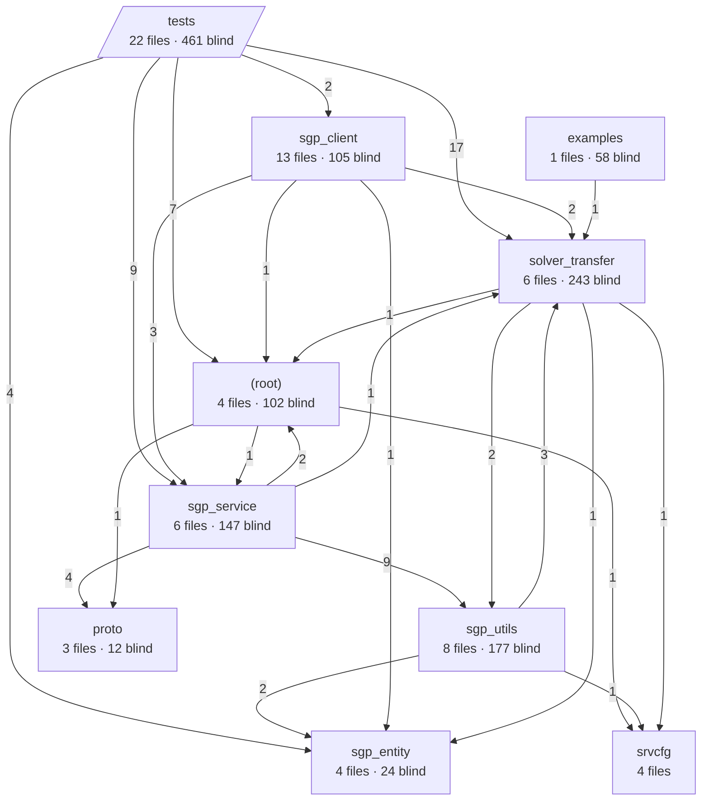

# Architecture Map

> codeblast M3-v0（目录级折叠）· 节点=模块（含文件数/盲区数），边=import 依赖（数字=强度）

| 模块 | 文件数 | 盲区 | 出边依赖 | 入边被依赖 |
|---|---|---|---|---|
| tests | 22 | 461 | 39 | 0 |
| sgp_client | 13 | 105 | 7 | 2 |
| sgp_utils | 8 | 177 | 6 | 11 |
| sgp_service | 6 | 147 | 16 | 13 |
| solver_transfer | 6 | 243 | 5 | 24 |
| (root) | 4 | 102 | 3 | 11 |
| sgp_entity | 4 | 24 | 0 | 8 |
| srvcfg | 4 | 0 | 0 | 3 |
| proto | 3 | 12 | 0 | 5 |
| examples | 1 | 58 | 1 | 0 |
